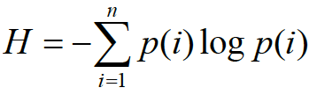
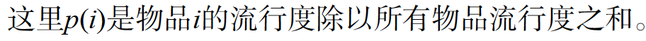
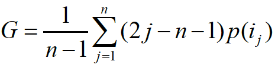
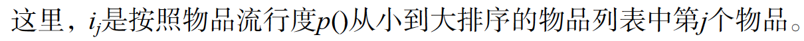

# 本章的几个核心问题

## 什么是推荐系统？

信息过载问题：随着信息技术与互联网的发展，人们逐渐从信息匮乏的时代走入[信息过载](https://zh.wikipedia.org/wiki/%E8%B3%87%E8%A8%8A%E8%B6%85%E8%BC%89)的时代。

在用户**没有明确需求**，**面临信息过载困境**的情况下，可以通过分析用户历史等信息生成个性化推荐的工具，称为推荐系统。

## 推荐系统的主要任务

简单来讲，就是联系用户和信息，帮助用户发现对自己有价值的信息，帮助信息展现给对它感兴趣的用户。

## 推荐系统和分类目录以及搜索引擎的主要区别

几个类似系统的比较
| 比较的项目 | 推荐系统 | 分类目录 | 搜索引擎 |
| :---: | :---: | :---: | :---: |
| 任务 | 推荐信息 | 将著名网站分门别类，满足用户查找的需求 | 寻找信息 |
| 用户需求 | 不明确 | 可以明确，可以不明确 | 必须明确 |
| 信息过载问题 | 能解决 | 不能解决 | 能解决 |
| 评价 | 帮助用户没有需求时发现新内容 | 相当于提供了一个网站索引，已过时？ | 满足用户有明确主动目的时的查找需求 |

总结：推荐系统和搜索引擎互补，但分类目录似乎已经过时？

## 目前业界常见的个性化推荐应用

（略）

## 推荐系统评测

### 三种评测推荐系统效果的实验方法

| 实验方法 | 步骤 | 优点 | 缺点 |
| :---: | :---: | :---: | :---: |
|离线实验|1.生成标准的用户数据集 2.数据集分为训练集和测试集 3.训练集上训练模型后在测试集上测试 4.评测结果|1.不需要系统的实际控制权 2.不需要用户参与实验 3.速度快、成本低，可快速测试大量算法|1.无法评测实际关心的一些指标，如点击率 2.离线实验的结果与商业应用存在差距|
|用户调查|直接询问用户或者花钱雇佣测试用户|1.可以获得很多主观感受指标 2.相对在线实验风险低，出错后易弥补|1.代价高昂，人多花钱多，人少统计意义不足 2.实验的客观性难以完全保障，使得测试结果可能与真实不符|
|在线实验|AB测试，即划分流量对不同模型进行测试|可以客观公平地获得实际在线时的性能指标|1.周期长 2.设计复杂|

通常的做法是，依次做这三个实验

### 评测指标

<table border="1">
    <thead>
        <th>评价指标</th>
        <th>定义</th>
        <th>地位</th>
        <th>测量</th>
        <th>优劣</th>
    <thead>
    <tr>
        <td>用户满意度</td>
        <td>用户对推荐系统的满意程度</td>
        <td>评测推荐系统最重要的指标</td>
        <td>通常为问卷；在线系统中，对用户行为统计分析</td>
        <td></td>
    </tr>
    <tr>
        <td>预测准确度</td>
        <td>衡量推荐系统预测用户行为的能力</td>
        <td>最重要的离线指标</td>
        <td>
            评分预测：均方根误差（RMSE）、平均绝对误差（MAE） 
            TopN推荐：召回率/准确率（直观理解，前者表示推荐了多少应该推荐的，后者表示推荐的有多少是应该推荐的）；为准确评测TopN推荐，还会画出准确率/召回率曲线
        </td>
        <td>评分预测能预测用户的评分，但TopN推荐能推荐用户喜欢的东西，后者更具实际应用价值？</td>
    </tr>
    <tr>
        <td>覆盖率</td>
        <td>推荐系统对长尾物品的发掘能力</td>
        <td></td>
        <td>
            最简单的方式为推荐系统能够推荐出来的物品占总物品集合的比例 
            信息熵 
            基尼系数
        </td>
        <td>评测推荐系统是否具有马太效应的方法就是测量基尼系数</td>
    </tr>
    <tr>
        <td>多样性</td>
        <td></td>
        <td></td>
        <td></td>
        <td></td>
    </tr>
    <tr>
        <td>新颖性</td>
        <td></td>
        <td></td>
        <td></td>
        <td></td>
    </tr>
    <tr>
        <td>惊喜度</td>
        <td></td>
        <td></td>
        <td></td>
        <td></td>
    </tr>
    <tr>
        <td>信任度</td>
        <td></td>
        <td></td>
        <td></td>
        <td></td>
    </tr>
    <tr>
        <td>实时性</td>
        <td></td>
        <td></td>
        <td></td>
        <td></td>
    </tr>
    <tr>
        <td>健壮性</td>
        <td></td>
        <td></td>
        <td></td>
        <td></td>
    </tr>
    <tr>
        <td>商业目标</td>
        <td></td>
        <td></td>
        <td></td>
        <td></td>
    </tr>
</table>